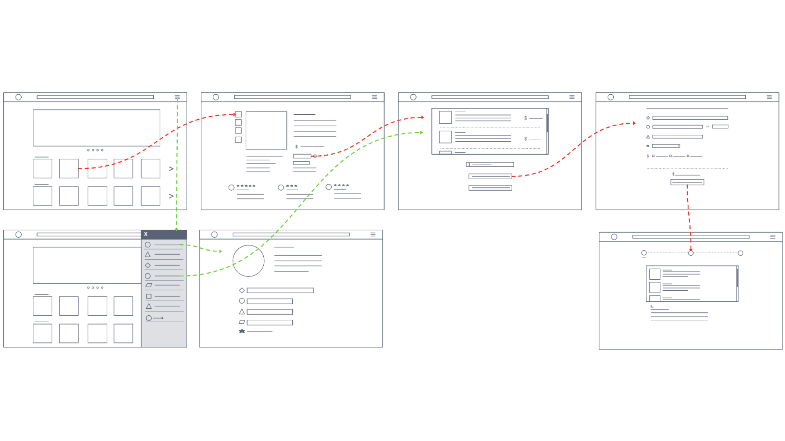
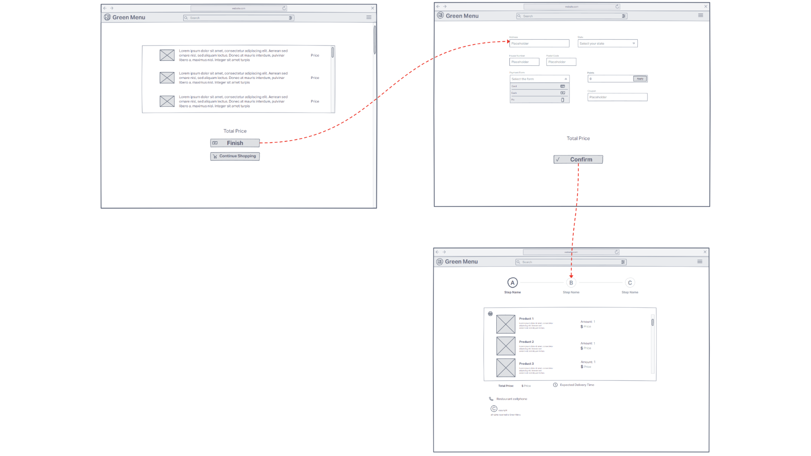

# green-menu-uiux

## Overview

This repository hosts the project files for the development of a restaurant delivery application called **Green Menu**. This application provides users with access to healthy meals and snacks made from organic ingredients.

It was developed as part of the UI/UX course at Federal University of Alfenas.

## 5W and 1H Analysis

In this phase, we conducted a thorough exploration using the 5W and 1H methodology, addressing key questions to outline the project's scope and objectives.

## User Research

More than 40 participants provided valuable feedback through surveys and interviews, guiding the design decisions. Statistical results are detailed below.

## Personas

Two personas were crafted based on the research findings, representing key user segments.

 

## User Journey

The user journey was mapped out using Custellence, illustrating the steps users take within the application.

 

## Crazy 8s

A brainstorming session utilizing the Crazy 8s method generated various ideas for app features. Green highlighted features were considered core and integrated into the design.

### Mobile

### Desktop

## Low Fidelity Prototypes

Low-fidelity prototypes were created using InVision, providing a basic visual representation of the app's layout and flow.

### Mobile

 

### Desktop

 

## Atomic Models

Atomic models were employed to break down the app's design into its fundamental building blocks.

## Wireframe

Wireframes, developed with InVision, served as a skeletal framework for the app's layout and functionality.

### Mobile

 

### Desktop

## Style Guide

The style guide defines the visual elements and design principles used throughout the application.

## Mockups

High-fidelity mockups were created to visualize the final design of the app.

### Mobile

 
 

### Desktop

## High Fidelity Prototypes

Final high-fidelity prototypes were developed using Figma. Preview images for both mobile and desktop versions are provided below, along with links to the prototypes.

### Mobile

[See details](https://www.figma.com/proto/eazZEqo9HxD89UOcye0Q9d/UIUX?node-id=89-1386&t=2frovcX0uZerH4gl-0&scaling=scale-down&page-id=89%3A1386&starting-point-node-id=375%3A1521)

### Desktop

[See details](https://www.figma.com/proto/eazZEqo9HxD89UOcye0Q9d/UIUX?node-id=353-1669&t=2frovcX0uZerH4gl-0&scaling=scale-down&page-id=89%3A1385&starting-point-node-id=353%3A1669)

## Usability Testing

Usability testing was conducted to refine the final high-fidelity prototype based on user feedback and insights.

## Team members

- Bárbara Silveira Rodrigues
- Daniel Costa Lima
- Heloisa Pimentel de Souza
- Leonardo Reis Coimbra
- Maria Eduarda Santos Silva
- Renan Magalhães Lage

***
